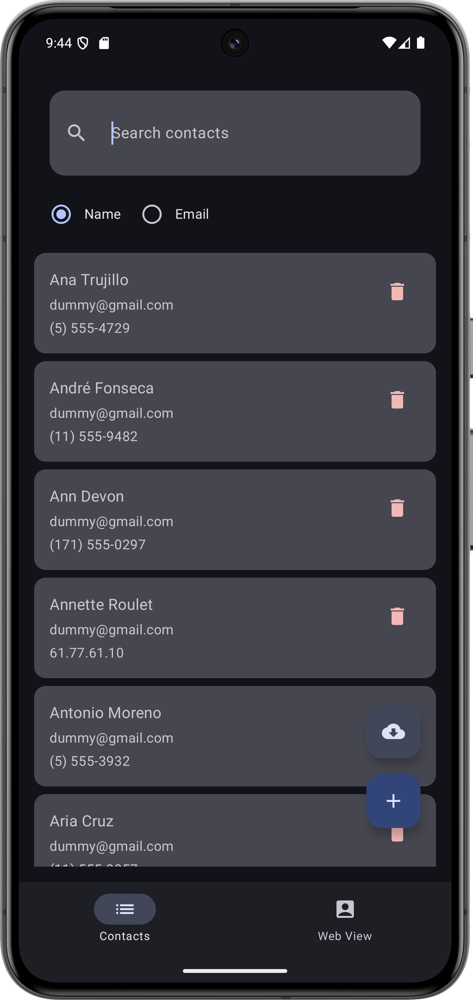
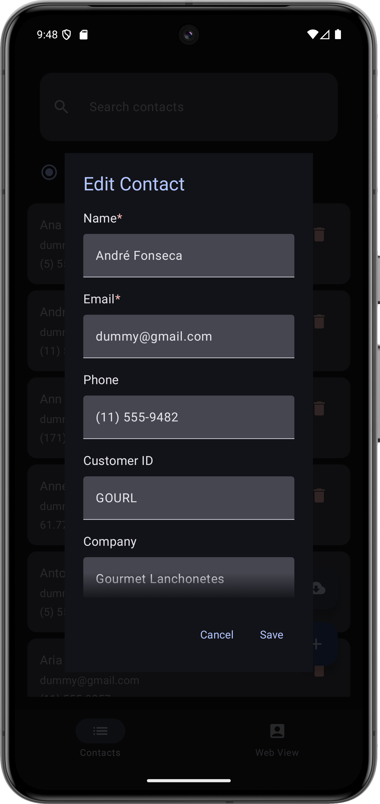
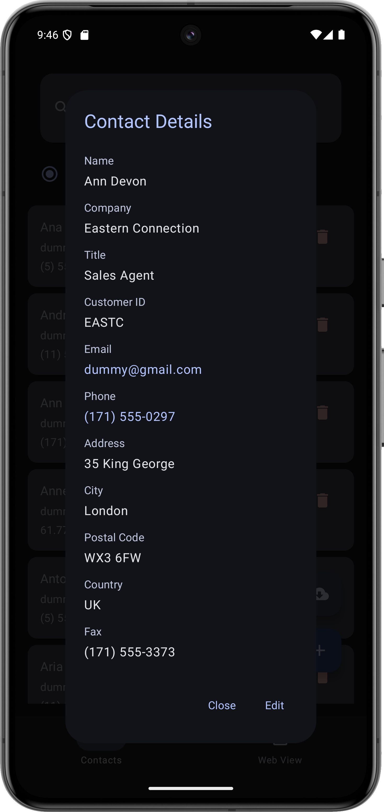
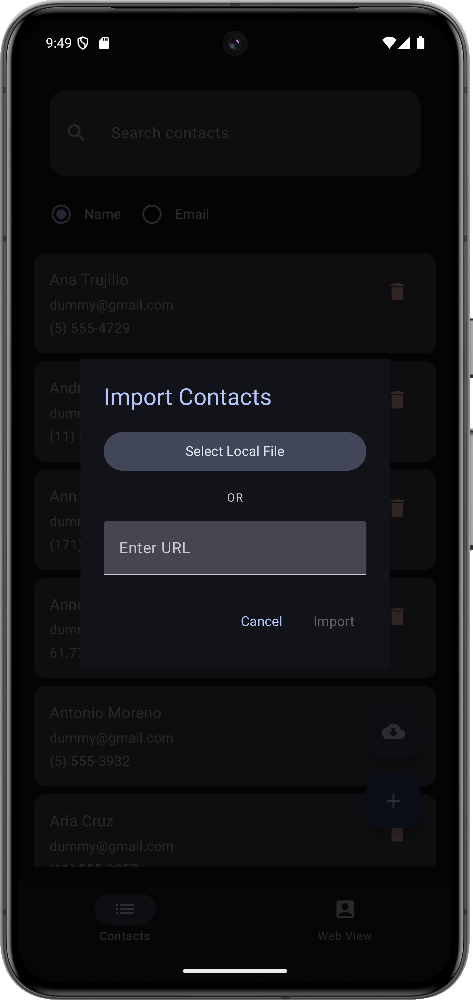

## Project Overview & Challenges

This project was developed as an exploration of WebView integration within Android applications, combining AngularJS with native Kotlin/Jetpack Compose functionality.

### WebView Implementation Challenges
- First attempt at integrating WebView in an Android project
- Faced difficulties with Angular-Android context communication
- Variables from the Angular frontend failed to bind with Android backend
- Browser debugging revealed missing Android context in both local and mobile environments

### Solution Approach
1. Implemented a split-view architecture:
    - Primary view: Native Jetpack Compose interface for contact management
    - Secondary view: WebView toggle option for future integration
    - Allows seamless switching between native and web views

### Learning Outcomes
- Gained practical experience with Jetpack Compose and MVVM architecture
- Better understanding of WebView limitations and context requirements
- Identified Kotlin Multiplatform as a potential alternative for future projects

### Current Status
- Fully functional native contact management system
- WebView integration remains a work in progress
- Successfully implemented core features: contact CRUD operations, search, and import functionality

### Future Considerations
- Explore Kotlin Multiplatform for cross-platform development
- Research alternative approaches to WebView integration
- Improve Angular-Android context communication

## Features and Implementation

### Contact List

- View all contacts in a sortable list
- Search contacts by name or email
- Material 3 design with dynamic theming

### Contact Management

- Add new contacts
- Edit existing contacts
- Delete contacts
- Form validation for required fields

### Contact Details

- View detailed contact information
- Quick launch functions for email and phone
- Material design cards for organized information

### Import Functionality

- Import contacts from external sources
- Success confirmation messages -- Bug still remains --
- Duplicate handling

## Technical Stack

- **Frontend**: AngularJS embedded in WebView
- **UI Framework**: Jetpack Compose
- **Architecture**: MVVM
- **Concurrency**: Kotlin Coroutines
- **Database**: Room
- **DI**: Hilt
- **State Management**: StateFlow

